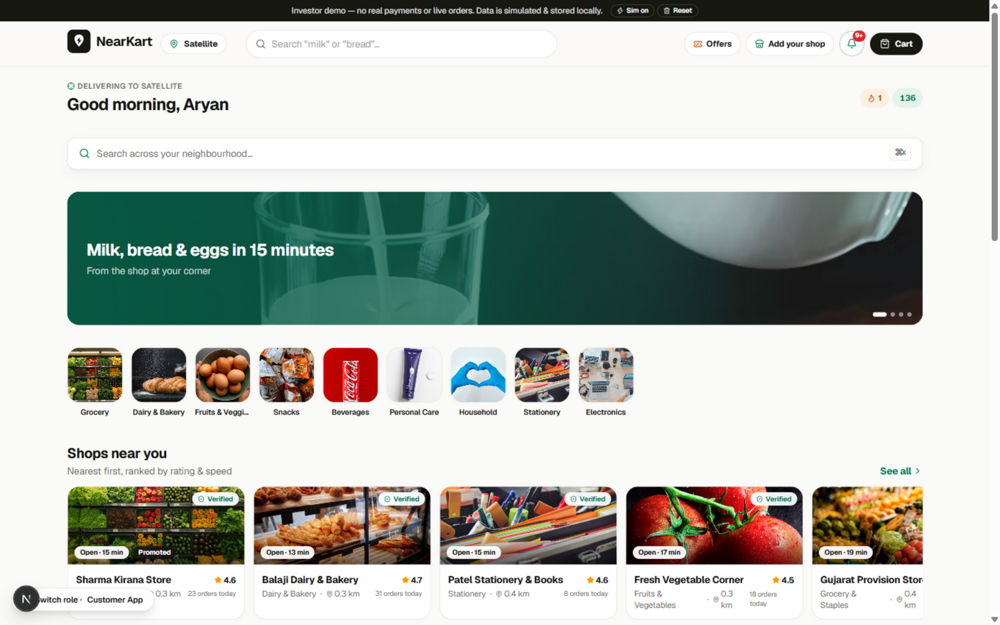
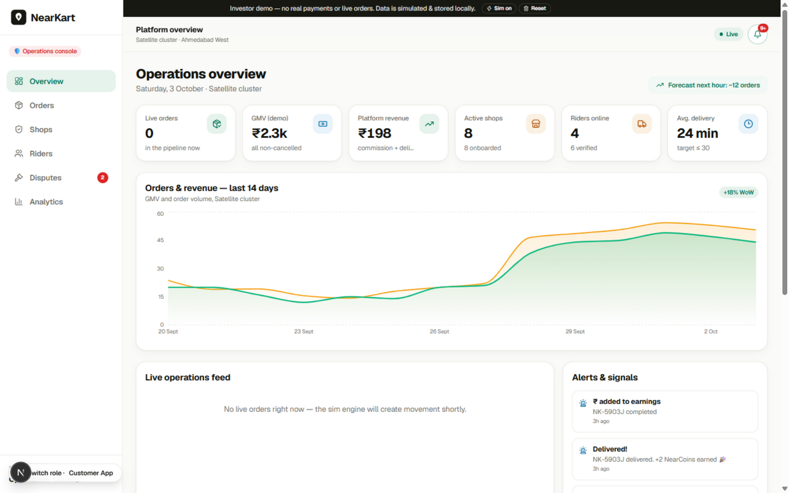

# NearKart — the anti-dark-store quick-commerce platform

> **Your local shops, delivered fast.**
> A hyperlocal marketplace that turns neighbourhood stores into micro-fulfilment centres — 15–30 minute delivery, zero warehouses.

**🚀 Live demo (deployed on Vercel):**

| App | Link |
|---|---|
| 🛒 Customer | https://near-kart-iota.vercel.app/customer |
| 🏪 Shop owner | https://near-kart-iota.vercel.app/shop |
| 🛵 Rider | https://near-kart-iota.vercel.app/rider |
| 🧭 Admin | https://near-kart-iota.vercel.app/admin |

|  |  |
|---|---|
| **Customer app** — discovery, cart & live tracking | **Admin console** — ops, disputes & analytics |

This repository is a **fully working investor demo**: four interconnected apps (Customer, Shop, Rider, Admin) running on one shared live order engine. Place an order as a customer and watch it appear in the shop dashboard, get picked up by a rider, and land in the admin console — in real time, even across browser tabs.

---

## Quick start (no VS Code needed)

Double-click **`Run NearKart.bat`** on Windows — it installs dependencies on first run, starts the dev server, and opens the app in your browser.

Or from a terminal:

```bash
npm install
npm run dev        # http://localhost:3000
npm run build      # production build
```

## The 60-second demo script (for investors)

1. **Landing page** — the pitch: "Dark stores rent your neighbourhood. NearKart lives in it."
2. **Customer App** (`/customer`) — add items to the cart, watch the free-delivery progress bar, apply coupon `NEAR25`, and check out (COD or demo UPI).
3. **Shop Dashboard** (`/shop`) — the same order arrives with a 2-minute accept timer. Accept it → stock auto-deducts → mark it packed.
4. **Rider App** (`/rider`) — the job card appears with distance, payout and countdown. Accept, enter the pickup OTP, ride, enter the delivery OTP. Earnings update instantly.
5. **Admin Console** (`/admin`) — live orders feed, GMV charts, verification queues, dispute centre with a liability matrix.
6. **Pro move:** open two browser tabs (Customer + Shop). Orders sync live via storage events.

All state is simulated: **no real payments, OTPs, maps or databases**. Everything persists in `localStorage`. Use the **Reset** button in the top banner to start fresh, and **Live sim ON/OFF** to toggle the auto-progress engine.

## What's simulated vs. real

| Simulated (demo) | Real (working) |
|---|---|
| Payments, OTPs, phone calls | Cart, checkout, coupons, NearCoins |
| Maps & navigation | Full order state machine across 4 modules |
| SMS/WhatsApp notifications | Stock automation (deduct/restore/auto-hide) |
| Document KYC checks | Ranking, ETA, rider-matching & fraud algorithms |
| PDF invoices | Live simulation engine + cross-tab sync |
| CSV/barcode catalog import | Charts, ledgers, dispute workflows |

## Product surface

- **Customer**: discovery with smart shop ranking, search across shops, shop pages with live stock states (in stock / "Only 3 left" / auto-hidden), cart with ₹100 minimum + basket-builder nudges, checkout with tips, live tracking with OTP + timeline, ratings, NearCoins loyalty, streaks, referrals.
- **Shop**: availability toggle (Online/Busy/Offline), 2-minute order acceptance timer with auto-accept guard, reject-with-replacement flow, inventory table with inline stock editing and bulk actions, offers manager with performance, payout ledger with 7% commission + 1% GST TCS breakdown, onboarding wizard.
- **Rider**: online toggle, transparent job cards (payout shown before accepting), step-by-step trip flow with pickup/delivery OTP and photo proof, daily goal gamification, earnings formula (base + distance + peak + tips), instant payout.
- **Admin**: KPI deck with animated counters, 14-day orders/revenue chart, live ops feed, alerts (rider shortage, high-cancellation zones), shop & rider verification queues, order monitoring with immutable timeline, dispute centre, analytics (category demand, payment mix, zone×hour heatmap, cohorts, unit economics).

## The strategy layer

See **[STRATEGY.md](./STRATEGY.md)** for the full "missing 9" — the brand system, psychology playbook, algorithms, growth loops, revenue architecture, moat thesis and go-to-market plan that wrap around this product.

## Tech

Next.js 16 (App Router) · TypeScript · Tailwind CSS v4 · Zustand (persisted store + cross-tab sync) · Framer Motion · Recharts · Lucide

```
src/
  app/            landing + customer/shop/rider/admin route trees
  components/     ui primitives, brand shell, customer shared cards
  data/           realistic Ahmedabad mock data (8 shops, 90+ SKUs, riders, orders…)
  lib/            algorithms (ranking, matching, ETA, fraud, forecast) + utils
  store/          the live order engine (Zustand)
  types/          domain model
```

## Production roadmap

1. **Backend**: PostgreSQL + Prisma, NestJS services (orders, inventory, delivery, settlement), Redis + BullMQ for the state machine.
2. **Real infra**: Razorpay/Cashfree payments, Firebase/WhatsApp notifications, Google Maps/MapmyIndia, Meilisearch.
3. **Compliance**: GST TCS filings, FSSAI display, KYC vendor, gig-worker social security contributions.
4. **Scale**: rider batching, demand forecasting on real data, POS integrations, shop credit, white-label storefronts.

---

## Author

**Aryan Patel** — Computer Engineering (ENO: 240753107021)
Guided by **Dr. Anil Suthar**, Principal
Bapu Gujarat Knowledge Village

- 📧 aryan04102001@gmail.com
- 🌐 Live demo: https://near-kart-iota.vercel.app

## License

Released under the [MIT License](./LICENSE).
